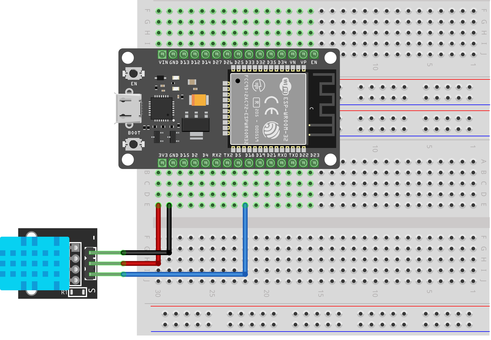
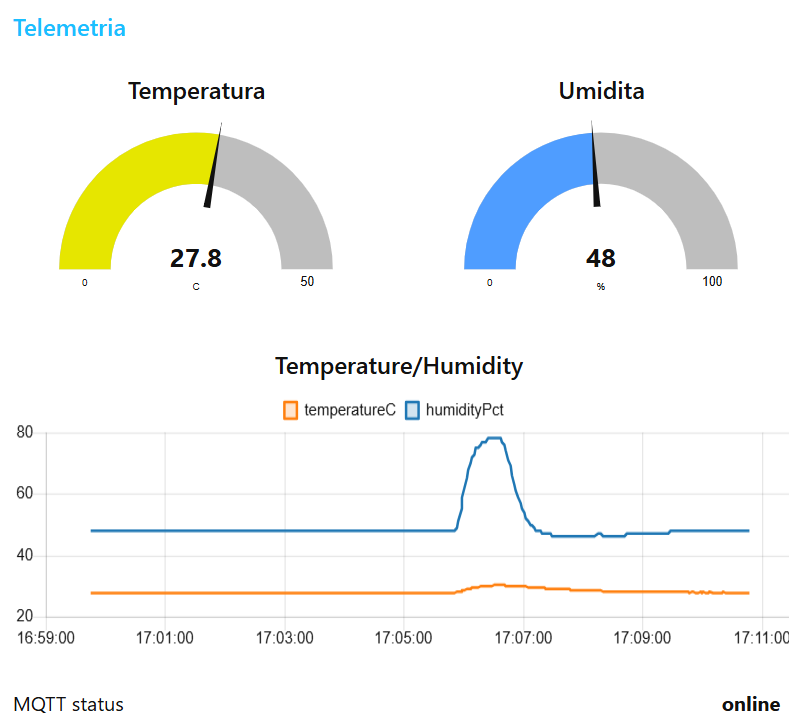

# Report Progetto Environment Monitor

## 1. Introduzione

Questo progetto copre i seguenti argomenti trattati durante il corso di Sistemi Operativi Mobili:
- **Programmazione embedded** su microcontrollori ESP32
- **Internet of Things (IoT)** con connettività Wi-Fi e MQTT
- **Gestione concorrente** dei task tramite sistema operativo real-time FreeRTOS
- **Protocollo MQTT** per la telemetria e il controllo remoto
- **Visualizzazione dati** tramite dashboard Node-RED

Il firmware realizza un sistema di monitoraggio ambientale che acquisisce temperatura e umidità da un sensore DHT11, attiva un'uscita LED basata su soglia di temperatura e pubblica i dati su un broker MQTT per la visualizzazione remota.

---

## 2. Requisiti del Progetto

| Parametro | Valore | Descrizione |
|-----------|--------|-------------|
| **Sensore** | DHT11 | Temperatura (°C) e umidità (%) |
| **Periodo acquisizione sensore** | 2000 ms | Lettura DHT11 ogni 2 secondi |
| **Periodo controllo attuatore** | 500 ms | Aggiornamento LED ogni 500 ms |
| **Soglia temperatura** | 30°C | Attivazione LED oltre questa soglia |
| **Periodo MQTT** | 1000 ms | Loop MQTT e pubblicazione telemetria |
| **QoS MQTT** | 1 | At-least-once delivery |
| **Microcontrollore** | ESP32 DOIT DevKit v1 | Dual-core (core 1 dedicato ai task) |
| **Baud rate seriale** | 9600 | Velocità comunicazione seriale |

### Architettura FreeRTOS

Il firmware crea **tre task indipendenti** attivi su core 1:

| Task | Funzione | Periodo |
|------|----------|---------|
| **SensorTask** | Lettura DHT11 e aggiornamento dati condivisi | 2000 ms |
| **ActuatorTask** | Controllo LED basato su soglia temperatura | 500 ms |
| **MqttTask** | Connessione Wi-Fi/MQTT e pubblicazione telemetria | 1000 ms |

L'accesso ai dati condivisi è protetto da **mutex FreeRTOS** per evitare race condition.

---

## 3. Schema Elettrico

### Componenti principali

- **ESP32 DOIT DevKit v1** con antenna Wi-Fi e LED onboard
- **Sensore DHT11** (3 pin: VCC, GND, DATA)
- **Breadboard e cavetti di collegamento**

### Pinout ESP32

| Componente | GPIO ESP32 | Note |
|------------|-----------|------|
| DHT11 DATA | GPIO 18 | Ingresso dati sensore |
| LED onboard | GPIO 2 | LED integrato della board (attivo alto) |
| USB | GND, +5V | Alimentazione e debug seriale |



---

## 4. Struttura dei Sorgenti

Il progetto è organizzato in moduli riutilizzabili:

```
environment_monitor/
├── include/
│   └── project_config.h          # Configurazione centralizzata (pin, periodi, MQTT)
├── src/
│   └── main.cpp                  # Entry point Arduino (sketch)
├── lib/
│   ├── dht11_sensor_module/      # Driver acquisizione DHT11
│   ├── mqtt_client_module/       # Client MQTT con PubSubClient
│   ├── task_manager/             # Orchestrazione task FreeRTOS
│   └── [altre dipendenze]
└── docs/
    └── freertos_task_manager.md  # Documentazione architettura task
```

### Moduli principali

#### `project_config.h`
Centralizza tutte le costanti:
- Pin GPIO (DHT11, LED)
- Periodi di campionamento
- Credenziali Wi-Fi
- Configurazione MQTT (broker, topic, QoS)

#### `main.cpp`
Arduino sketch minimale che inizializza il serial monitor (9600 baud) e avvia il task manager FreeRTOS. La logica applicativa risiede nei tre task gestiti da FreeRTOS, non nel loop Arduino classico.

#### `dht11_sensor_module`
API C-style per l'acquisizione del sensore DHT11:
- `Dht11SensorModule_InitializeDht11Sensor()` – Configura il GPIO
- `Dht11SensorModule_ReadDht11Sensor()` – Legge T/umidità e validità

Utilizza la libreria esterna **DHTesp** per ESP32.

#### `task_manager`
Crea e gestisce i tre task FreeRTOS con sincronizzazione mutex:
- **SensorTask**: Legge periodicamente DHT11 e aggiorna struttura condivisa
- **ActuatorTask**: Accende LED se temperatura > 30°C
- **MqttTask**: Mantiene connessione Wi-Fi/MQTT e pubblica telemetria

#### `mqtt_client_module`
Wrapper su PubSubClient per:
- Gestione della connessione con reconnect non bloccante
- Pubblicazione telemetria in JSON
- Last Will & Testament (LWT) per status

### Dipendenze esterne (platformio.ini)

```
lib_deps = 
    beegee-tokyo/DHT sensor library for ESPx
    knolleary/PubSubClient
```

---

## 5. Protocollo MQTT

### Configurazione

- **Broker**: `broker.hivemq.com` (HiveMQ pubblico)
- **Porta**: 1883 (no SSL)
- **Client ID**: `esp32-ambient-monitor`
- **Livello QoS**: **1** (At-least-once delivery)

### Topic structure

| Topic | Direzione | Contenuto | Frequenza |
|-------|-----------|-----------|-----------|
| `sistemi_operativi_mobili/environment_monitor/telemetry` | Publish | JSON: `{temperature, humidity, timestamp, valid}` | ~1000 ms* |
| `sistemi_operativi_mobili/environment_monitor/status` | Publish | "online" / "offline" (LWT) | Connessione |

*Solo quando il sensore fornisce un nuovo campione

### Payload JSON esempio

```json
{
  "temperature": 26.5,
  "humidity": 55.3,
  "timestamp": 123456789,
  "valid": true
}
```

### QoS Level 1 - Comportamento

Il livello QoS 1 garantisce che ogni messaggio raggiunga il broker **almeno una volta**, con ACK dal server: ideale per applicazioni di monitoraggio dove la perdita occasionale di dati è tollerabile.

---

## 6. Integrazione Node-RED

### Architettura della dashboard

1. **MQTT In**: sottoscrive il topic `sistemi_operativi_mobili/environment_monitor/telemetry`
2. **JSON parser**: estrae i valori T/umidità dal payload
3. **Chart nodes**: visualizza grafici storici
4. **Gauge nodes**: mostra valori attuali
5. **Status indicator**: rappresenta lo stato online/offline via topic status

### Flow di base

Il flow Node-RED riceve il JSON telemetrico e lo invia a:
- Nodi grafici per visualizzazione storica
- Nodi di stato per feedback UI
- (Opzionale) Salvataggio in database InfluxDB

### Risultati visualizzati

- **Grafico temperatura**: trend orario con media mobile
- **Grafico umidità**: andamento percentuale
- **Gauge digitali**: valori attuali in tempo reale
- **Indicatore stato**: online/offline basato su LWT
- **Log telemetria**: ultimi campioni ricevuti

---

## 7. Risultati Ottenuti

### Funzionalità implementate e verificate

**Acquisizione sensore DHT11**
- Lettura stabile ogni 2 secondi
- Validazione dati (flag isValid)
- Gestione errori I²C

**Controllo LED attuatore**
- Accensione/spegnimento basato su soglia 30°C
- Aggiornamento ogni 500 ms
- Debug via seriale

**Connettività MQTT**
- Connessione Wi-Fi STA su `TP-Link_Novello`
- Reconnect automatico non bloccante
- Pubblicazione JSON con QoS 1

**Architettura concorrente**
- Tre task FreeRTOS indipendenti
- Sincronizzazione via mutex
- Nessun tempo di attesa tramite uso di vTaskDelay()

**Visualizzazione Node-RED**
- Dashboard con grafici e gauge
- Aggiornamento in tempo reale
- Storico dati telemetria

### Screenshot della dashboard



---

## 8. Conclusioni

Il progetto **environment_monitor** mostra l'integrazione di:

1. **Firmware embedded** robusto e modulare su ESP32
2. **Concorrenza controllata** via FreeRTOS con pattern mutex
3. **IoT end-to-end**: sensore → MQTT broker → visualizzazione
4. **Protocollo MQTT** production-ready con QoS e LWT
5. **Visualizzazione remota** tramite Node-RED

### Competenze acquisite

- Configurazione GPIO e lettura sensori analogici/digitali
- Programmazione multi-task con protezione della sezione critica
- Wi-Fi e MQTT su ESP32
- Dashboard IoT con Node-RED
- Debugging embedded e logging seriale
